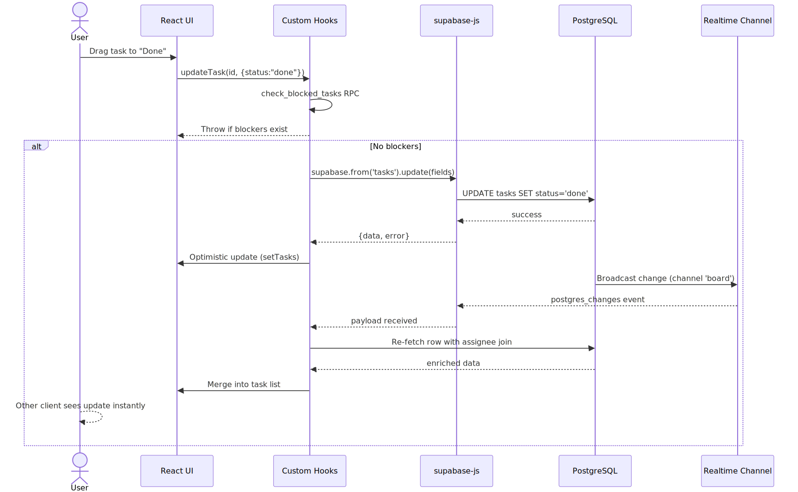

# PivotPoint — Visión General del Proyecto

> **PivotPoint** es un tablero Kanban en tiempo real construido con React 19 y Supabase. Gestión de tareas drag-and-drop con actualizaciones en vivo entre todos los clientes.

---

## 1. 项目核心业务流程 / Flujo de Negocio Central

El flujo completo de un usuario desde que visita la aplicación por primera vez hasta que gestiona tareas en tiempo real:



1. **Verificación de entorno** — Si faltan variables de entorno (`VITE_SUPABASE_URL`/`VITE_SUPABASE_ANON_KEY`), se muestra una pantalla de configuración.
2. **Autenticación** — Login/signup via Supabase Auth (email + password).
3. **Control de roles** — El sistema verifica el rol del perfil:
   - `unknown` → Pantalla de solicitud de acceso (join request).
   - `member` → Acceso de solo lectura a tareas asignadas.
   - `admin` → CRUD completo sobre todas las tareas.
4. **Dashboard** — Vista general con estadísticas y proyectos.
5. **Tablero Kanban** — Gestión de tareas: crear, editar, eliminar, reordenar drag-and-drop.
6. **Sincronización en tiempo real** — Cada cambio se transmite inmediatamente a todos los clientes conectados via Supabase Realtime.
7. **Vistas alternativas** — Gantt (diagrama de Gantt) y Esfera 3D (visualización three.js).
8. **Exportación** — Descargar tablero como XLSX, PDF o CSV.

---

## 2. 功能点 / Puntos de Funcionalidad

### Gestión de Tareas (Core)
| Funcionalidad | Descripción |
|---|---|
| CRUD de tareas | Crear, leer, actualizar, eliminar tareas |
| Drag & Drop | Reordenar tarjetas y mover entre columnas via @dnd-kit |
| Posicionamiento | `positionBetween()` — midpoint en reorden, `max + 1024` en inserción |
| Prioridades | P0 (crítica), P1 (alta), P2 (media), P3 (baja) |
| Fechas de vencimiento | Asignación de due_date con vistas inteligentes |
| Asignación | Asignar tareas a miembros del equipo |
| Dependencias | Bloqueo de tareas: mover a "Done" requiere completar blockers |
| Etiquetas | Labels por proyecto para categorización |

### Sistema de Roles y Permisos
| Funcionalidad | Descripción |
|---|---|
| Admin | CRUD completo, gestión de miembros |
| Member | Solo lectura, puede editar tareas asignadas |
| Unknown | Sin acceso, puede solicitar ingreso |
| Promoción | `admin_set_role` RPC y modal de administración |
| RLS | Row-Level Security en PostgreSQL |

### Proyectos
| Funcionalidad | Descripción |
|---|---|
| Creación de proyectos | Con nombre, descripción y color |
| Archivar/Restaurar | Cambiar estado entre active/archived |
| Miembros | `project_members` con roles por proyecto |
| Tablero compartido | Proyecto null = tablero global sin proyecto |

### Vistas
| Vista | Tecnología | Descripción |
|---|---|---|
| Kanban | @dnd-kit | Columnas Todo / Doing / Done con drag & drop |
| Gantt | frappe-gantt | Diagrama temporal de tareas |
| 3D Sphere | three.js | Visualización espacial de tareas |
| Dashboard | Custom | Estadísticas, progreso, actividad |
| List View | Custom | Vista de lista tabular |
| Smart Views | Filtros cliente | `view:mine`, `view:due` (≤7d), `view:overdue` |

### Colaboración en Tiempo Real
| Funcionalidad | Descripción |
|---|---|
| Realtime Sync | Canal `supabase.channel('board')` para cambios en tasks |
| Presence | `usePresence()` — muestra usuarios online |
| Editors | `useTaskEditing()` — quién está editando qué tarea |
| Notificaciones | Disparadores en DB: due_soon, overdue, assignment, mention |

### Experiencia de Usuario
| Funcionalidad | Descripción |
|---|---|
| Temas | Claro/Oscuro via `[data-theme]` y `useTheme()`, persistido en localStorage |
| i18n | 5 idiomas: EN, ES, ZH, ID, AR (RTL) |
| Atajos de teclado | `Ctrl/Cmd+N` nueva tarea, `Ctrl/Cmd+F` filtro |
| Exportación | XLSX (exceljs), PDF (jspdf), CSV |
| Respaldos | Backup/Restore via RPC |
| Perfiles | Avatar, display_name, preferencias |

---

## 3. 技术点 / Puntos Técnicos

### Arquitectura del Sistema



| Capa | Tecnología |
|---|---|
| Frontend | React 19 + Vite 8 + Tailwind CSS 4 |
| Drag & Drop | @dnd-kit/core@6, @dnd-kit/sortable@10, @dnd-kit/utilities@3 |
| Backend | Supabase (Auth, PostgREST, Realtime, Storage) |
| Base de Datos | PostgreSQL con PostgREST (API REST automática) |
| Testing | Vitest 4 + Testing Library + jsdom |
| Build | Vite 8 (Rolldown en producción, esbuild en dev) |

### Jerarquía de Componentes



```
src/
├── main.jsx                  # Entry point
├── App.jsx                   # Root: auth gate, routing, layout
├── api/
│   └── supabaseClient.js     # Cliente Supabase (null si faltan env vars)
├── hooks/
│   ├── useAuth.js            # Sesión, login, signup, logout
│   ├── useBoard.js           # Tasks CRUD + realtime + position system
│   ├── useProfile.js         # Perfil del usuario
│   ├── useProjects.js        # Gestión de proyectos
│   ├── useMembers.js         # Miembros del proyecto
│   ├── useTheme.js           # Toggle claro/oscuro
│   ├── usePresence.js        # Usuarios online via Realtime Presence
│   ├── useTaskEditing.js     # Tracking de edición concurrente
│   ├── useTaskStats.js       # Estadísticas del tablero
│   └── useLabels.js          # Etiquetas por proyecto
├── components/               # ~40 componentes UI
└── locales/                  # 5 archivos JSON de traducción
```

### Base de Datos (PostgreSQL)



| Tabla | Propósito |
|---|---|
| `profiles` | Perfiles de usuario (display_name, avatar, role) |
| `tasks` | Tareas: título, descripción, estado, prioridad, fecha, posición |
| `projects` | Proyectos con nombre, estado (active/archived) |
| `project_members` | Miembros por proyecto con rol |
| `labels` / `task_labels` | Etiquetas por proyecto, asignación N:N a tareas |
| `task_dependencies` | Dependencias entre tareas |
| `notifications` | Notificaciones con tipo y estado de lectura |
| `invitations` / `join_requests` | Invitaciones por email y solicitudes de acceso |

### Flujo de Datos en Tiempo Real



1. Usuario realiza acción (drag, crear, editar) en la UI
2. Custom hook realiza llamada a Supabase via supabase-js
3. PostgreSQL procesa la operación y actualiza la tabla
4. Supabase Realtime detecta el cambio y lo transmite a todos los clientes suscritos al canal `board`
5. Cada cliente re-fetch la fila modificada con joins (assignee profile) y hace merge optimista

### Sistema de Roles (RBAC)



- **Trigger `handle_new_user()`**: Primera persona → admin, nuevas → unknown (a menos que tenga invitación)
- **RLS Policies**: 3 niveles de acceso por fila según el rol
- **Column-level security**: `created_by` es inmutable post-insert
- **RPCs clave**: `admin_set_role`, `check_blocked_tasks`, `add_task_dependency`, `is_admin()`

### Configuración de Desarrollo

```bash
# Frontend (desde frontend/)
npm install
npm run dev          # Vite dev (port 5173, LAN accesible, usePolling: true)
npm test             # Vitest (excluye api.test.js)
npm run build        # Producción con Rolldown

# Supabase (desde raíz o supabase/)
supabase start       # Iniciar Supabase local
supabase db push     # Aplicar migraciones
supabase db reset    # Resetear todo + seed
supabase db seed     # Solo seed (requiere auth user)
```

### Convenciones y Gotchas

- **Rolldown exige indentación consistente** en JSX — expresiones inline mal alineadas fallan en build de producción
- **Test globals**: `vi`, `describe`, `it`, `expect` sin import
- **Mock Supabase**: `createMockSupabase()` en `tests/mockSupabase.js`
- **Migrations**: 24 archivos SQL (`20260612100000` → `20260630000003`) — fuente de verdad de la DB
- **backend/ es código muerto**: Scaffold NestJS huérfano, gitignored
- **No hay scripts de lint/typecheck**: Usar `npx eslint` manualmente

---

## Resumen Técnico

| Aspecto | Detalle |
|---|---|
| Stack | React 19 + Vite 8 + Tailwind 4 + Supabase |
| DB Migrations | 24 SQL files |
| Componentes | ~40 React components |
| Hooks personalizados | 10 hooks |
| Tests | ~30 archivos de test (Vitest) |
| Idiomas | 5 (en, es, zh, id, ar) |
| Vistas | Kanban, Gantt, 3D Sphere, Dashboard, List |
| Exportación | XLSX, PDF, CSV |
| Tiempo real | Supabase Realtime + Presence |
| Roles | admin, member, unknown |
